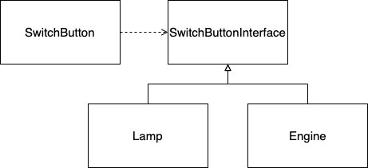
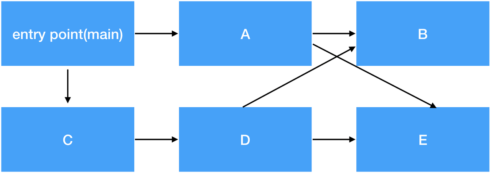
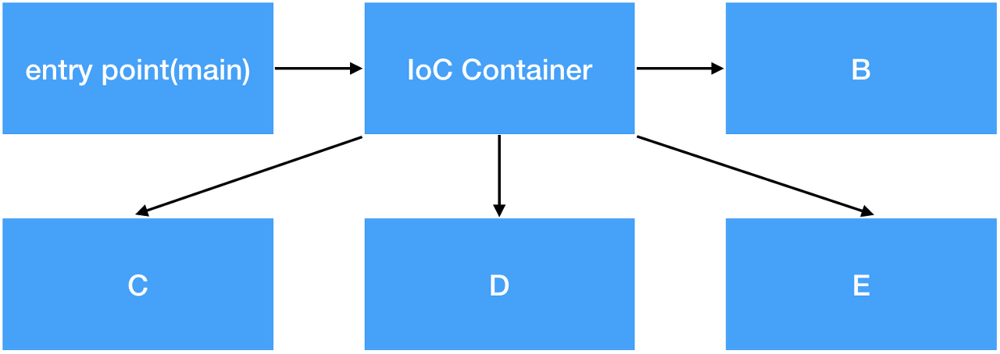
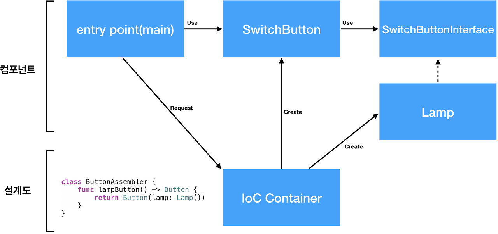

# SOLID 원칙 중 DIP
## DIP(의존성역전의 원칙 : Dependency Inversion Principle)
의존 관계의 역전이란 구조적 디자인에서 발생하던 하위 레벨 모듈의 변경이 상위 레벨 모듈의 변경을 요구하는 위계관계를 끊는 의미의 역전이다. 실제 사용 관계는 바뀌지 않으며, 추상을 매개로 메시지를 주고 받음으로써 관계를 최대한 느슨하게 만드는 원칙이다.
### DIP 키워드
- IoC
- 훅 메소드
- 확장성

## IoC(Inversion of Control, 제어의 역전)
### Dependency (의존성)
우선 IoC 를 알아보기 전에 Dependency 의 개념을 알아보자.

Client A 가 Service B를 의존한다. 무슨 의미일까? 
- Client 는 Service 를 이용하는 Class
- Service 는 특정 기능을 API 를 통해 제공해주는 Class

여기서 의존한다는 의미는 Client A 가 Service B 를 멤버 변수나 로컬 변수로 가지고 있거나 혹은 파라미터로 전달되거나 Service B 의 메소드를 호출하는 것들을 의미한다.
```kotlin
class ClientA() {
    val service = ServiceB()
    service.startService()
}

class ServiceB() {
    fun startService() {}
}
``` 
> A 는 B 를 의존하고 있다.
- 만약에 ServiceB 가 변경된다면?

ClientA 에서는 강하게 의존되어있기 때문에 컴파일이 안되거나 예상치 못한 동작을 하는 등의 영향을 받게 된다. 그러면 ClientA 는 재사용하기 어렵다. 즉, Component 가 될 수 없다.
- Component 란?
    - 소스 코드의 아무런 수정 없이 다른 프로젝트에서도 바로 재사용이 가능한 수준의 모듈

이로인한 문제점은 고차원 모듈이 저차원 모듈을 의존하고 저차원 모듈이 다시 고차원 모듈을 의존하는 `의존성 부패`가 일어난다.

이러한 문제점을 개선하기 위해서 `일반적인 디자인 방법인 DIP` 를 설명할 수 있다.
### DIP(Dependency Inversion Principle)
> 고차원 모듈은 저차원 모듈에 의존하면 안된다. 이 모듈 모두 다른 추상화된 것에 의존해야 한다. 추상화 된 것은 구체적인 것에 의존하면 안 된다. 구체적인 것이 추상화된 것에 의존해야 한다.

- 아래 그림처럼 '구체적인 것이 추상화된 것에 의존해야 한다'


- Dependency 문제가 있는 SwitchButton
    - 아래 코드와 그림을 보면 알 수 있듯이 Lamp 클래스만 재사용 가능하며, SwitchButton 클래스는 재사용할 수 없다. 이는 의존성 문제가 일어난 방법이다.
```kotlin
class SwitchButton() {
    val lamp = Lamp()
    var isOn = false

    fun toggle() {
        isOn = !isOn

        if (isOn) lamp.lightOn()
        else lamp.lightOff()
    }
}

class Lamp() {
    fun lightOn() {
        print("lamp on")
    }
    fun lightOff() {
        print("lamp off")
    }
}

```


- 위 Dependency(의존성) 문제를 DIP를 적용하여 해결한 방법
    - 아래 SwtichButton 클래스에서는 이제 Lamp 클래스를 의존하지 않기 때문에 재사용이 가능해졌다.
```Kotlin
class SwitchButton() {
    val lamp: SwitchButtonInterface = Lamp()
    var isOn = false

    fun toggle() {
        isOn = !isOn

        if (isOn) lamp.on()
        else lamp.off()
    }
}

interface SwitchButtonInterface {
    fun on()
    fun off()
}

class Lamp(): SwitchButtonInterface {
    override fun on() {
        lightOn()
    }
    override fun off() {
        lightOff()
    }
}
```


- 추가적으로 설명해보자. 위 의존성 부패를 해결된 DIP 코드에서 SwitchButton 과 Lamp 의 의존성만 역전한다고 의존성 문제가 해결되는가?
```kotlin
class SwitchButton() {
    val lamp: SwitchButtonInterface = Lamp()
}
``` 
위 코드를 보면 의존성을 역전시켜 SwitchButtonInterface 를 참조하도록 하긴했지만 Lamp 클래스를 직접 생성하고 있다. 그렇기 때문에 class 의존성이 남아있다.
- Factory Pattern 을 적용하면 Lamp 와 class Dependency(의존성)을 제거할 수 있다.
```kotlin
class SwitchButton() {
    val lamp: SwitchButtonInterface = Factory.getObject()
}
```
Factory Pattern 을 적용하여 SwitchButton 클래스의 Lamp class dependency 를 제거했다. Factory 는 SwitchButton 이 알지 못하게 SwitchButtonInterface 를 구현한 어떤 concrete class 를 반환한다. (즉, Factory.getObject() 처럼)
> concrete class 란?   
: 추상 클래스와 대조적 의미라, 거의 추상 클래스를 제외한 모든 클래스라고 생각해도 무방하다.
- SwitchButton 은 Factory 에 강하게 dependency 하고 있다.

이러한 문제점은 다른 프로젝트에서 재사용하려면 결국 Factory 를 수정해야 적용할 수 있다. 즉, SwitchButton 은 아직도 component가 되지 못한다.
### DI (Dependency Injection, 의존성 주입)
의존성 주입 말은 어렵지만, 프로그래밍을 처음 배울 때 사용한다.
- 아래 코드는 c언어의 main 함수다. 인자로 argc 와 argv 를 주입받고 있다. **이렇게 외부로부터 전달받는 것을 의존성 주입이라고 한다.**
```c
int main(int argc, char *argv[]) {}
```
- 생성자 주입(Constructor Injection)을 적용한 SwitchButton 클래스이다.
    - 자 이제 SwitchButton 클래스는 Factory 나 Lamp 를 의존하지 않는 독립적인 존재가 되었다. **어떠한 concrete 에 대한 dependency 가 없으니 외부로부터의 변경사항에 대한 영향도가 매우 적어졌다.** 즉, 재사용 가능한 Component 가 되었다.
> DI 는 크게 Constructor Injection, Interface Injection, Method Injection 으로 사용된다. 하지만 좀 더 명확한 Constructor Injection 을 선호한다.
```java
class SwitchButton(val switchHandler: SwitchButtonInterface) {}
```
### IoC (Inversion of Control, 제어의 역전)
- DIP 와 DI가 적용된 SwitchButton
```kotlin
fun main() {
    val button = SwitchButton(switchHandler = Lamp())
}
```
Client 는 Lamp 를 생성해 SwitchButton 에 생성자에 외부로부터 주입을 하고 있다. SwitchButton 은 Lamp 를 모르겠지만 말이다. 그런데 잘 생각해보면 Client 가 Lampe 를 생성하고 SwitchButton 과 관계를 설정하고 있는 오히려 더 이상해진 상황이 연출되었다.

- 그렇기 때문에 IoC(역전된 제어)의 흐름을 볼 수 있어야 한다.


- SwitchButton 의 적용된 IoC
    - Client(entry point) 가 IoC Container에게 필요한 Object 요청
    - IoC Container 는 SwitchButton 이 필요한 Object 을 생성하고 관계를 연결하여 전달한다.

즉, 각 클래스들이 다른 클래스에 대한 dependency 가 모두 사라졌다. 



### 참조
https://www.nextree.co.kr/p6960/   
https://develogs.tistory.com/19