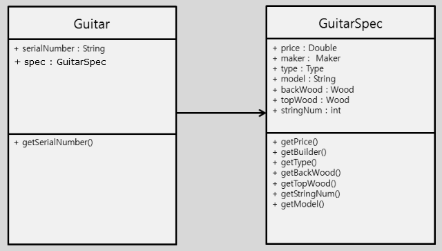
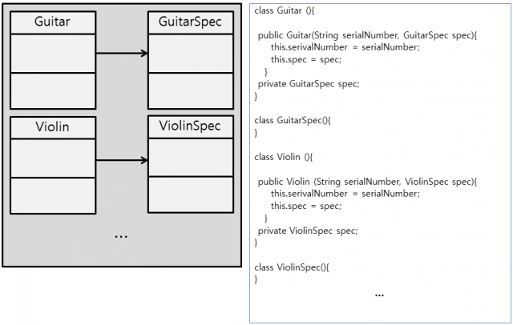
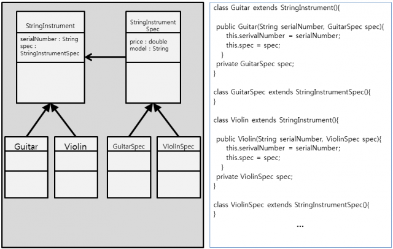

# SOLID 원칙 중 OCP
## OCP (개방폐쇄의 원칙 : Open Close Principle)
소프트웨어의 구성요소(컴포넌트, 클래스, 모듈, 함수)는 확장에는 열려있고, 변경에는 닫혀있어야 한다는 원리이다. 이는 변경을 위한 비용은 가능한 줄이고 확장을 위한 비용은 가능한 극대화 해야 한다는 의미이다. 요구사항의 변경이나 추가사항이 발생하더라도, 기존 구성요소는 수정이 일어나지 말아야 하며, 기존 구성요소를 쉽게 확장해서 재사용할 수 있어야 한다는 뜻이다.
### 적용방법
- 변경(확장)될 것과 변하지 않을 것을 엄격히 구분한다.
- 이 두 모듈이 만나는 지점에 인터페이스를 정의한다.
- 구현에 의존하기보다 정의한 인터페이스에 의존하도록 코드를 작성한다.
### 적용사례
- 이 사례는 변화하는 속성을 GuitarSpec 으로 모은 SRP 를 적용한 사례이다.

> 자 여기서 다른 문제는 없어보이나 Guitar 말고 바이올린이나 첼로, 비올라 등 다른 악기들도 다루어야 한다면 어떻게 될까? 이는 새로운 악기들과 요소들을 만들어 변화에 염두해두고 있어야 한다. 아래 그림처럼 말이다.
- OCP 적용 전

> 위 사례는 변화에 적절히 대응할 뿐이다. 그러면 어떻게 해야할까? Guitar 와 추가 될 새로운 악기들을 추상화하는 작업이 필요로하다. StringInstrument 라는 인터페이스를 생성한다.
- OCP 적용 후

> 이렇게 새로운 악기가 추가 되면서 변경이 발생하는 부분을 추상화 하여 분리하였음을 확인할 수 있고, 이는 코드의 수정을 최소화하여 결합도는 줄이고 응집도는 높이는 효과를 볼 수 있다.

___
### 참조
https://www.nextree.co.kr/p6960/