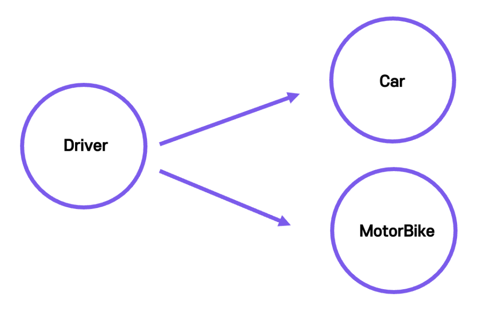
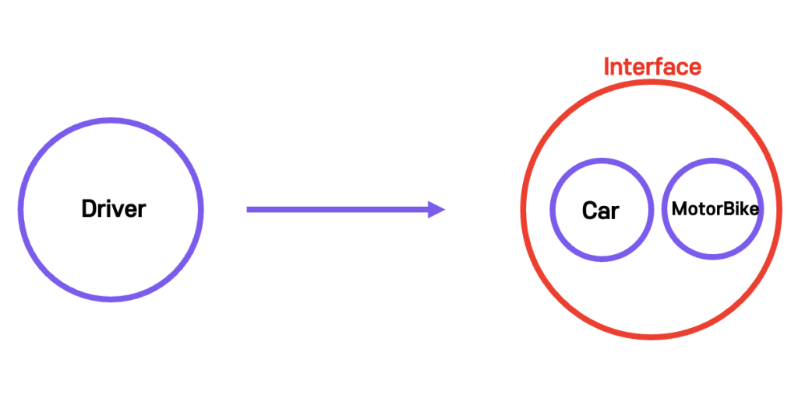

# 다형성
## 다형성이란?
다형성은 **어떤 객체의 속성이나 기능이 상황에 따라 여러 가지 형태를 가질 수 있는 성질**을 의미한다.
아래 그림처럼 남자는 부모, 친구, 팀장, 동호회 리더 처럼 다양한 형태를 가질 수 있다.

## 객체지향의 다형성이란?
위의 의미와 동일하며 객체지향 프로그래밍에 적용시킬 수 있으며 대표적인 특징이다. 대표적으로 오버라이드, 오버로딩이 있다. 객체지향의 다형성을 예시로 살펴보는 것이 이해하기 쉽다.

`Vehicle 인터페이스`
```java
public interface Vehicle {
    void moveForward();
    void moveBackward();
}
```
`Car 클래스`
```java
public class Car implements Vehicle {
    @Override
    public void moveForward(){
        // 전진
    }
    @Override
    public void moveBackward(){
        // 후진
    }
}
```
`MotorBike 클래스`
```java
public class MotorBike implements Vehicle {
    @Override
    public void moveForward(){
        // 전진
    }
    @Override
    public void moveBackward(){
        // 후진
    }
}
```
`Driver 클래스`
```java
public class Driver() {
    void drive(Vehicle vehicle) {
        vehicle.moveForward();
        vehicle.moveBackward();
    }
}
```
`Main 실행 클래스`
```java
public class Main {
    public static void main() {
        Car car = new Car();
        MotorBike motorBike = new MotorBike();
        Driver driver = new Driver();

        driver.drive(car);
        driver.drive(motorBike);
    }
}
```
`Vehicle 인터페이스 적용 전`
```java
public class Driver() {
    void drive(Car car) {
        car.moveForward();
        car.moveBackward();
    }
    void drive(MotorBike motorBike) {
        motorBike.moveForward();
        motorBike.moveBackward();
    }
    void drive(Bus bus) {
        bus.moveForward();
        bus.moveBackward();
    }
    ...
}
```

`위 그림을 밑에 처럼 Vehicle 인터페이스를 만들어줌으로써 결합도를 낮추는 역할을 해주었다.`

> Vehicle 이라는 Car 와 MotorBike 가 상속하는 부모 인터페이스가 없다면 위와 같이 탈 것인 종류마다 전진과 후진의 기능을 부여해주어야 한다. 우리는 이러한 결합도 높은 객체들의 관계를 좀 더 개선한 것이다.
>> 문제점<br>
    Main 에서 Car 와 MotorBike 를 new 하여 객체를 생성하는 것이 결합도가 높아보인다. 이를 해결하기 위해서 의존관계 주입의 개념을 이용하여 해결할 수 있다. 

___
### 참조
https://www.codestates.com/blog/content/%EA%B0%9D%EC%B2%B4-%EC%A7%80%ED%96%A5-%ED%94%84%EB%A1%9C%EA%B7%B8%EB%9E%98%EB%B0%8D-%ED%8A%B9%EC%A7%95