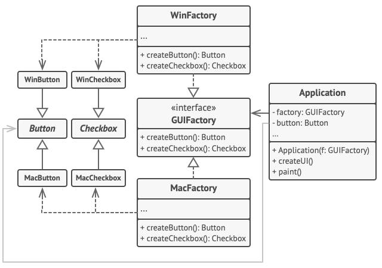

# 추상 팩토리
추상 팩토리는 디자인 패턴 중 생성 패턴으로 사용된다. 생성 패턴은 기존 코드의 재활용과 유연성을 증가시키는 객체 생성 메커니즘들을 제공한다.   
추상 팩토리는 관련 객체들의 구상 클래스들을 지정하지 않고도 관련 객체들의 모음을 생성할 수 있도록 하는 생성패턴입니다.
## 의사코드

## 코틀린 예제 코드
- 동작 구조   
`Application(WinFactory) : factory 는 Window OS 를 가진다.`   
`button = factory.createButton() : WindowButton 을 인스턴스화 한다.`   
`button.paint() : WinButton 클래스의 paint() 메서드가 불린다.`
```kotlin
class Application(factory: GUIFactory){
    private lateinit var factory: GUIFactory
    private lateinit var button: Button
    init {
        this.factory = factory
    }
    fun createUI(){
        this.button = factory.createButton()
    }
    fun paint(){
        button.paint()
    }
}

interface GUIFactory{
    fun createButton():Button
    fun createCheckBox():CheckBox
}

class WinFactory(): GUIFactory{
    override fun createButton(): Button {
        return WinButton()
    }

    override fun createCheckBox(): CheckBox {
        return WinCheckBox()
    }
}

class MacFactory(): GUIFactory{
    override fun createButton(): Button {
        return MacButton()
    }

    override fun createCheckBox(): CheckBox {
        return MacCheckBox()
    }
}

interface Button{
    fun paint()
}
class WinButton():Button{
    override fun paint() {}
}
class MacButton():Button{
    override fun paint() {}
}

interface CheckBox{
    fun paint()
}

class WinCheckBox(): CheckBox{
    override fun paint() {}
}

class MacCheckBox(): CheckBox{
    override fun paint() {}
}
```
## 장단점
### 장점
- 팩토리에서 생성되는 제품들의 상호호환을 보장
- 구상 제품들과 클라이언트 코드 사이의 단단한 결합을 피할 수 있다.
- SRP 원칙을 따름
- OCP 원칙을 따름
### 단점
- 새로운 인터페이스들과 클래스들이 많이 도입되기 때문에 코드가 필요 이상으로 복잡해질 수 있다.

## 참조
https://refactoring.guru/ko/design-patterns/abstract-factory