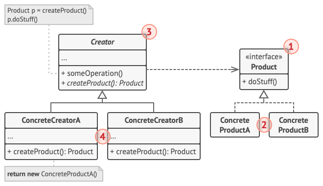
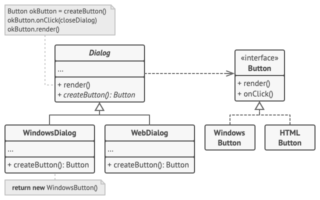

# 팩토리 메서드
팩토리 메서드는 디자인 패턴 중 생성 패턴으로 사용된다. 생성 패턴은 기존 코드의 재활용과 유연성을 증가시키는 객체 생성 메커니즘들을 제공한다.
## 팩토리 메서드의 의도
팩토리 메서드는 부모 클래스에서 객체들을 생성할 수 있는 인터페이스를 제공하지만, 자식 클래스들이 생성될 객체들의 유형을 변경할 수 있는 생성 패턴이다.
### 클라이언트 코드
> 여기서 팩토리 메서드를 사용하는 코드를 종종 클라인언트 코드라고 부른다.<br>
클라이언트 코드는 다양한 자식 클래스들에서 실제로 반환되는 여러 제품 간의 차이에 대해 알지 못한다.
## 팩토리 메서드의 구조

>여기서 createProduct() 는 팩토리 메서드가 된다.
## 코틀린 예제 코드

```kotlin
abstract class Dialog(){
    fun render(){}
    abstract fun createButton(): Button
}
class WindowsDialog(): Dialog(){
    override fun createButton(): Button {
        return WindowsButton()
    }
}
class WebDialog(): Dialog(){
    override fun createButton(): Button {
        return HTMLButton()
    }
}

interface Button{
    fun render()
    fun onClick()
}

class WindowsButton():Button{
    override fun render() {}
    override fun onClick() {}
}

class HTMLButton(): Button{
    override fun render() {}
    override fun onClick() {}
}
```
## 적용
- 팩토리 메서드는 당신의 코드가 함께 작동해야하는 객체들의 정확한 유형들과 의존관계들을 미리 모르는 경우 사용하자
- 팩토리 메서드는 당신의 라이브러리 또는 프레임워크의 사용자들에게 내부 컴포넌트들을 확장하는 방법을 제공하고 싶을 때 사용하자
- 팩토리 메서드는 기존 객체들을 매번 재구축하는 대신 이들을 재사용하여 시스템 리소스를 절약하고 싶을 때 사용하자
## 장단점
### 장점
- 크리에이터와 구상 제품들이 단단하게 **결합되지 않도록 할 수 있다.**
- <strong>단일책임원칙(SRP)</strong>으로 제품 생성 코드를 프로그램의 한 위치로 이동하여 **코드를 더 쉽게 유지관리**할 수 있다.
- <Strong>개방/폐쇄원칙(OCP)</strong>로 당신의 기존 클라이언트 코드(팩토리 메서드를 사용하는 코드)를 훼손하지 않고 새로운 유형의 제품들을 프로그램에 도입할 수 있다.
### 단점
- 많은 새로운 자식 클래스들을 도입해야 하므로 코드가 더 복잡해질 수 있다.

### 참조
https://refactoring.guru/ko/design-patterns/factory-method